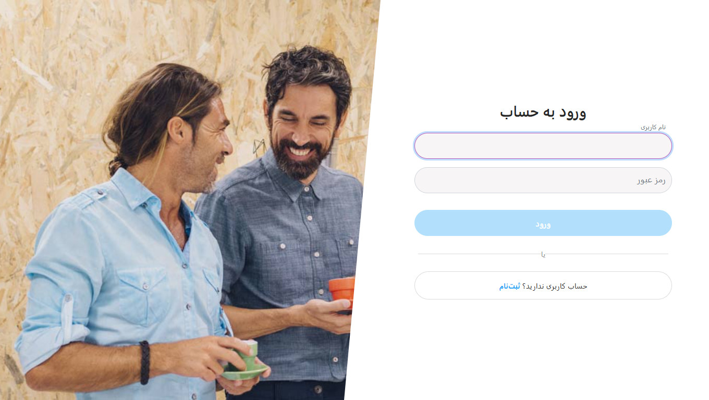
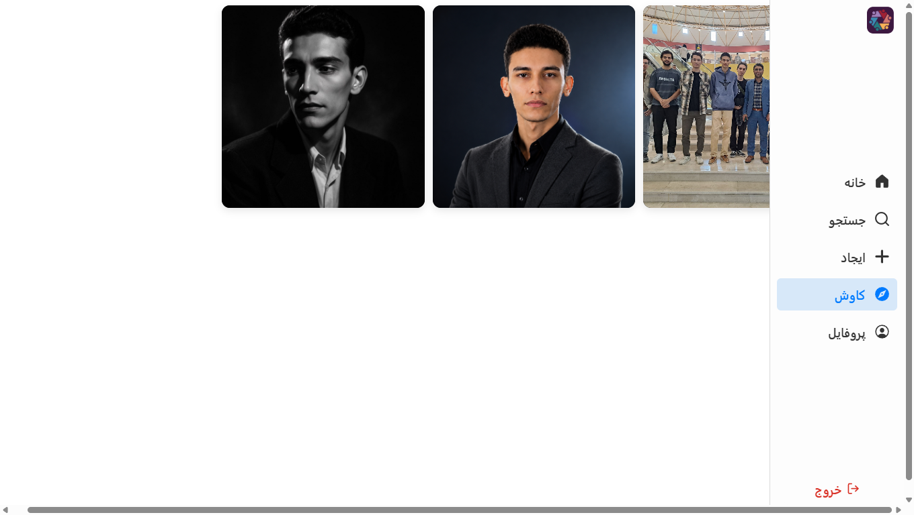
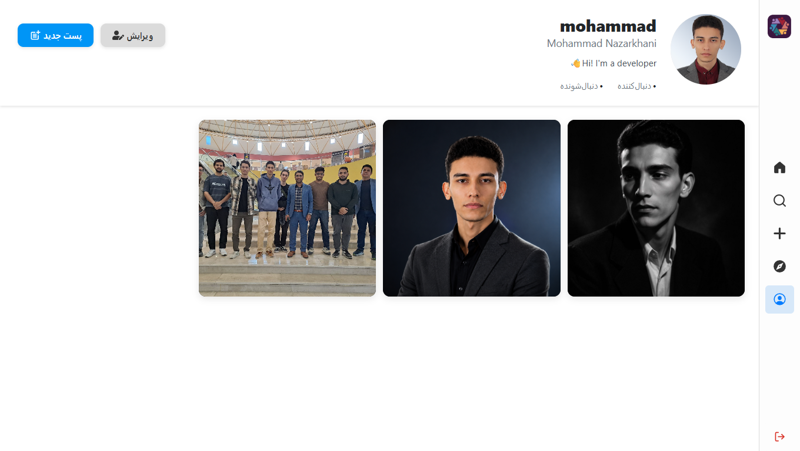

# SocialGram

SocialGram is an Instagram-inspired social media platform built with **ASP.NET Core Web API**, **React.js**, and **SQL Server**.

The project allows users to create accounts, customize their profiles, share posts, follow other users, interact through comments, and discover content from the community. It is designed to demonstrate full-stack development using modern backend and frontend technologies.

## Features

## Authentication & User Accounts

- User registration and login
- JWT-based authentication
- User profile management
- Upload and update profile avatar
- Add display name and bio
- Search for users

## User Profiles

- View user profiles
- View user posts
- View followers and following lists
- Follow and unfollow users
- Personalized profile pages similar to Instagram

## Posts

- Create posts with images
- Display posts in user profiles
- Delete posts
- Explore all posts from the community
- Home feed showing posts from followed users

## Comments

- Add comments to posts
- Delete comments
- Display comments on posts

## Discovery

- Search users
- Explore page for discovering all posts
- Home page with personalized feed

# Screenshots

## Login



## Side Navigation



## User Profile



## Post


## Search


# Tech Stack

## Backend

- ASP.NET Core Web API
- Entity Framework Core
- SQL Server
- JWT Authentication
- RESTful API Design

## Frontend

- React.js
- TypeScript
- CSS / Responsive UI
- Client-side API integration

## Database

- SQL Server
- Entity Framework Core Migrations
- Relational database design

# Architecture Overview

SocialGram follows a separated frontend and backend architecture:

```
React.js Frontend
        |
        |
        v
ASP.NET Core Web API
        |
        |
        v
Entity Framework Core
        |
        |
        v
SQL Server Database
```

The backend is responsible for:
- User authentication
- Business logic
- Data management
- API endpoints
- File handling

The frontend is responsible for:
- User interface
- Client-side interactions
- Communicating with the backend API

# Project Structure

```
SocialGram
│
├── backend
│   ├── Controllers
│   ├── Services
│   ├── Models
│   ├── DTOs
│   ├── Data
│   └── Migrations
│
├── frontend
│   ├── Components
│   ├── Pages
│   ├── Services
│   ├── Hooks
│   └── Assets
│
└── docs
    └── screenshots
```

# Database Entities

The main entities of the application include:

- User
- Post
- Comment
- Follow Relationship
- Media Files

The database relationships allow users to interact through posts, comments, and followers.

# Getting Started

## Prerequisites

Make sure you have installed:

- .NET SDK
- Node.js
- SQL Server
- Git

# Backend Setup

Clone the repository:

```bash
git clone <repository-url>
```

Navigate to the backend folder:

```bash
cd backend
```

Configure your SQL Server connection string in:

```
appsettings.json
```

Apply database migrations:

```bash
dotnet ef database update
```

Run the backend:

```bash
dotnet run
```

The API will start running locally.

# Frontend Setup

Navigate to the frontend folder:

```bash
cd frontend
```

Install dependencies:

```bash
npm install
```

Start the development server:

```bash
npm run dev
```

# API Features

The backend provides APIs for:

- Authentication
- User management
- Profiles
- Posts
- Comments
- Followers and followings
- Search
- Feed generation

# Future Improvements

Possible future improvements:

- Like system for posts
- Real-time notifications using SignalR
- Direct messaging
- Stories feature
- Infinite scrolling feed
- Image optimization
- Deployment with Docker
- Cloud storage for media files

# Purpose

This project was created as a portfolio project to demonstrate full-stack web development skills, including backend API development, frontend integration, database design, authentication, and building social media features.

# License

This project is for educational and portfolio purposes.